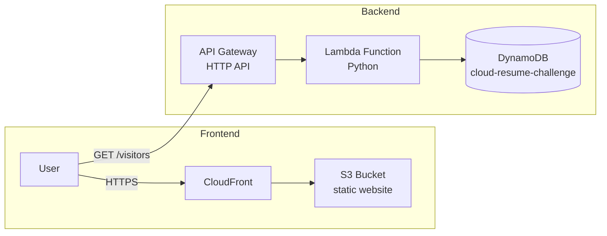

# Cloud Resume Challenge — AWS

My implementation of the [AWS Cloud Resume Challenge](https://cloudresumechallenge.dev/docs/the-challenge/aws/) — a static HTML/CSS resume website hosted on S3 + CloudFront with a serverless visitor counter powered by Lambda, API Gateway, and DynamoDB, fully defined as Infrastructure as Code and deployed via GitHub Actions CI/CD.

---

## Architecture



---

## Project Structure

```
cloud-resume-aws/
├── frontend/
│   ├── index.html          # Resume page
│   ├── style.css           # Responsive stylesheet
│   └── visitor-counter.js  # Fetches & displays visit count
│
├── backend/
│   ├── lambda_function.py  # Lambda handler (DynamoDB counter)
│   ├── test_lambda.py      # pytest unit tests
│   └── requirements.txt    # Python dependencies
│
├── infra/
│   └── template.yaml       # AWS SAM template (DynamoDB + Lambda + API GW)
│
├── .github/
│   └── workflows/
│       ├── backend-ci.yml  # Test → SAM deploy on backend/infra changes
│       └── frontend-ci.yml # S3 sync + CloudFront invalidation on frontend changes
│
└── README.md
```

---

## Prerequisites

| Tool | Version |
|------|---------|
| [AWS Account](https://aws.amazon.com/free/) | — |
| [AWS CLI](https://docs.aws.amazon.com/cli/latest/userguide/install-cliv2.html) | v2+ |
| [AWS SAM CLI](https://docs.aws.amazon.com/serverless-application-model/latest/developerguide/install-sam-cli.html) | latest |
| Python | 3.9+ |
| A registered domain name | — |

---

## Setup & Deployment

### Backend (Lambda + API Gateway + DynamoDB)

```bash
# 1. Install test dependencies
pip install -r backend/requirements.txt

# 2. Run unit tests
pytest backend/ -v

# 3. Build & deploy the SAM stack
cd infra
sam build
sam deploy --guided        # follow the prompts on first deploy
```

After deploying, copy the `VisitorApiUrl` output value and paste it into
`frontend/visitor-counter.js` (replace the `API_URL` TODO placeholder).

### Frontend (S3 + CloudFront)

> Complete steps 1–3 manually the first time, then CI/CD handles subsequent deploys.

1. Create an S3 bucket and enable **Static Website Hosting**.
2. Create a **CloudFront distribution** pointing at the S3 bucket.
   - (Optional) Attach an **ACM certificate** and a **Route 53 record** for a custom domain.
3. Sync the frontend files:

```bash
aws s3 sync frontend/ s3://YOUR_BUCKET_NAME --delete
aws cloudfront create-invalidation --distribution-id YOUR_DIST_ID --paths "/*"
```

---

## GitHub Actions CI/CD Secrets

Add the following secrets in **Settings → Secrets and variables → Actions**:

| Secret | Description |
|--------|-------------|
| `AWS_ACCESS_KEY_ID` | IAM user access key |
| `AWS_SECRET_ACCESS_KEY` | IAM user secret key |
| `S3_BUCKET_NAME` | S3 bucket name for the static site |
| `CLOUDFRONT_DIST_ID` | CloudFront distribution ID |

---

## Challenge TODO Checklist

- [ ] 1. Earn the AWS Cloud Practitioner certification (or higher)
- [ ] 2. Write the resume in HTML
- [ ] 3. Style the resume with CSS
- [ ] 4. Deploy the resume as a static website on Amazon S3
- [ ] 5. Use HTTPS — point CloudFront at the S3 bucket
- [ ] 6. Point a custom DNS domain at CloudFront (Route 53 or another registrar)
- [ ] 7. Add a visitor counter to the HTML page using JavaScript
- [ ] 8. Create a DynamoDB table to store the visitor count
- [ ] 9. Create a Lambda function (Python) that reads/increments the DynamoDB counter
- [ ] 10. Expose the Lambda via API Gateway
- [ ] 11. Write tests for the Lambda function (pytest)
- [ ] 12. Deploy backend infrastructure using AWS SAM (Infrastructure as Code)
- [ ] 13. Automate backend deploys with GitHub Actions (CI/CD)
- [ ] 14. Automate frontend deploys with GitHub Actions (CI/CD)

---

## Resources

- [Official Challenge Guide — AWS](https://cloudresumechallenge.dev/docs/the-challenge/aws/)
- [AWS SAM Documentation](https://docs.aws.amazon.com/serverless-application-model/latest/developerguide/)
- [AWS Free Tier](https://aws.amazon.com/free/)
