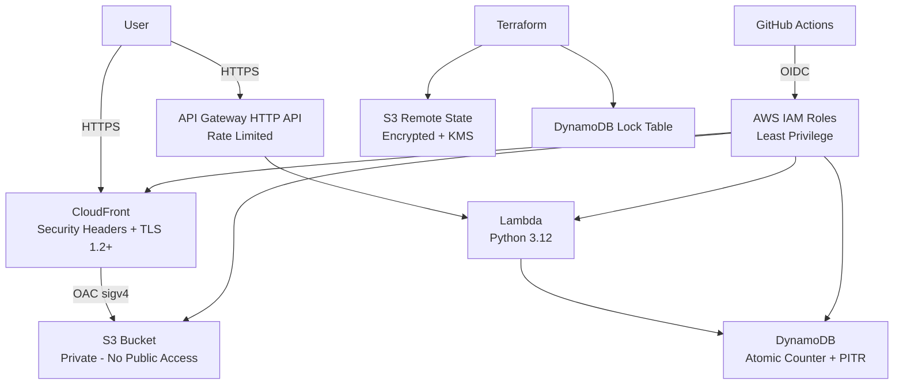

# Cloud Resume Challenge — AWS

A fully hardened implementation of the [AWS Cloud Resume Challenge](https://cloudresumechallenge.dev/docs/the-challenge/aws/): a static HTML/CSS resume hosted on S3/CloudFront with a serverless visitor counter backed by Lambda, API Gateway, and DynamoDB — all defined as Infrastructure as Code with **Terraform** and deployed via CI/CD with **zero long-lived AWS credentials**.

---

## Architecture



---

## Project Structure

```
cloud-resume-aws/
├── frontend/
│   ├── index.html          # Resume page
│   ├── style.css           # Responsive styles
│   └── visitor-counter.js  # Fetches view count from API Gateway
├── backend/
│   ├── lambda_function.py  # Lambda handler — atomic DynamoDB update
│   ├── test_lambda.py      # pytest unit tests (moto mock)
│   └── requirements.txt
├── infra/
│   ├── main.tf             # Providers (us-east-2 + us-east-1 alias)
│   ├── backend.tf          # S3 remote state + DynamoDB locking
│   ├── variables.tf
│   ├── outputs.tf
│   ├── dynamodb.tf         # Visitor counter table (PITR enabled)
│   ├── lambda.tf           # Lambda + least-privilege IAM
│   ├── api-gateway.tf      # HTTP API + throttling
│   ├── s3-cloudfront.tf    # Private S3, OAC, ACM, security headers
│   ├── oidc-github.tf      # GitHub OIDC + frontend/backend roles
│   ├── terraform.tfvars.example
│   └── .gitignore
├── .github/
│   └── workflows/
│       ├── backend-ci.yml  # Test + Terraform apply (pinned SHAs)
│       └── frontend-ci.yml # S3 sync + CloudFront invalidation (pinned SHAs)
├── README.md
└── .gitignore
```

---

## Security Features

- **OIDC federation** — GitHub Actions assumes IAM roles via short-lived tokens; no long-lived AWS credentials stored in secrets
- **Private S3 bucket** — all four public-access-block settings enabled; only CloudFront can read objects via OAC
- **Least-privilege IAM** — Lambda can only call `dynamodb:GetItem` and `dynamodb:UpdateItem` on the specific table
- **API Gateway rate limiting** — throttling burst=10, rate=5 requests/sec
- **Restrictive CORS** — API allows only `https://julesdiprima.com`, not `*`
- **CloudFront security headers** — HSTS (2 years + preload), X-Frame-Options: DENY, X-Content-Type-Options, Referrer-Policy, CSP, Permissions-Policy
- **TLS 1.2 minimum** — `TLSv1.2_2021` minimum protocol version on CloudFront
- **Encrypted remote Terraform state** — S3 backend with SSE-KMS + versioning + DynamoDB state locking
- **Lambda concurrency limit** — `reserved_concurrent_executions = 5` prevents runaway invocations
- **Atomic DynamoDB operations** — `update_item` with `ADD` expression; no get+put race condition
- **GitHub Actions pinned to commit SHAs** — all third-party actions reference exact SHAs, not mutable tags

---

## Prerequisites

- AWS account with administrator access (for initial bootstrap)
- [AWS CLI v2](https://docs.aws.amazon.com/cli/latest/userguide/install-cliv2.html) configured
- [Terraform >= 1.0](https://developer.hashicorp.com/terraform/install)
- Python 3.12
- A domain name (default: `julesdiprima.com`)

---

## Setup Instructions

### Step 1 — Create the Terraform state backend

Run these commands **once** before `terraform init`:

```bash
aws s3api create-bucket \
  --bucket cloud-resume-tfstate-julesdiprima \
  --region us-east-2 \
  --create-bucket-configuration LocationConstraint=us-east-2

aws s3api put-bucket-versioning \
  --bucket cloud-resume-tfstate-julesdiprima \
  --versioning-configuration Status=Enabled

aws s3api put-bucket-encryption \
  --bucket cloud-resume-tfstate-julesdiprima \
  --server-side-encryption-configuration \
    '{"Rules":[{"ApplyServerSideEncryptionByDefault":{"SSEAlgorithm":"aws:kms"}}]}'

aws s3api put-public-access-block \
  --bucket cloud-resume-tfstate-julesdiprima \
  --public-access-block-configuration \
    BlockPublicAcls=true,IgnorePublicAcls=true,BlockPublicPolicy=true,RestrictPublicBuckets=true

aws dynamodb create-table \
  --table-name terraform-locks \
  --attribute-definitions AttributeName=LockID,AttributeType=S \
  --key-schema AttributeName=LockID,KeyType=HASH \
  --billing-mode PAY_PER_REQUEST \
  --region us-east-2
```

### Step 2 — Configure variables

```bash
cd infra
cp terraform.tfvars.example terraform.tfvars
# Edit terraform.tfvars with your values
```

### Step 3 — Deploy infrastructure

```bash
terraform init
terraform plan
terraform apply
```

### Step 4 — Note the Terraform outputs

```
api_endpoint                  = "https://xxx.execute-api.us-east-2.amazonaws.com/visitors"
cloudfront_distribution_id    = "EXXXXXXXXXXXXX"
cloudfront_distribution_domain = "dxxxxxxxxxxxxx.cloudfront.net"
s3_bucket_name                = "cloud-resume-julesdiprima"
frontend_iam_role_arn         = "arn:aws:iam::123456789012:role/github-actions-frontend"
backend_iam_role_arn          = "arn:aws:iam::123456789012:role/github-actions-backend"
```

### Step 5 — Update the visitor counter endpoint

Edit `frontend/visitor-counter.js` and replace `REPLACE_WITH_API_GATEWAY_ENDPOINT` with the `api_endpoint` value from Terraform output.

### Step 6 — Add GitHub repository secrets

| Secret name            | Value                          |
|------------------------|--------------------------------|
| `FRONTEND_IAM_ROLE_ARN` | `frontend_iam_role_arn` output |
| `BACKEND_IAM_ROLE_ARN`  | `backend_iam_role_arn` output  |
| `S3_BUCKET_NAME`        | `s3_bucket_name` output        |
| `CLOUDFRONT_DIST_ID`    | `cloudfront_distribution_id` output |

### Step 7 — Configure DNS

Add DNS records pointing your domain to CloudFront:

| Type  | Name              | Value                              |
|-------|-------------------|------------------------------------|
| CNAME | `www`             | `<cloudfront_distribution_domain>` |
| ALIAS | `@` (apex domain) | `<cloudfront_distribution_domain>` |

### Step 8 — Validate ACM certificate

In the AWS Console → Certificate Manager → find the certificate for `julesdiprima.com` → add the CNAME validation records to your DNS provider.

### Step 9 — Push to main

Once DNS is configured, push to `main`. The CI/CD pipelines will:
- Backend: run Python tests → `terraform apply`
- Frontend: sync to S3 → invalidate CloudFront cache

---

## TODO Checklist (Cloud Resume Challenge Steps)

- [ ] 1. Certification (AWS Cloud Practitioner or higher)
- [ ] 2. HTML resume
- [ ] 3. CSS styling
- [ ] 4. Static website hosted on S3
- [ ] 5. HTTPS via CloudFront
- [ ] 6. Custom DNS (Route 53 or external provider)
- [ ] 7. JavaScript visitor counter
- [ ] 8. DynamoDB visitor count database
- [ ] 9. API (API Gateway + Lambda)
- [ ] 10. Python Lambda function
- [ ] 11. Tests for the Python code
- [ ] 12. Infrastructure as Code (Terraform)
- [ ] 13. Source control (GitHub)
- [ ] 14. CI/CD (GitHub Actions)

